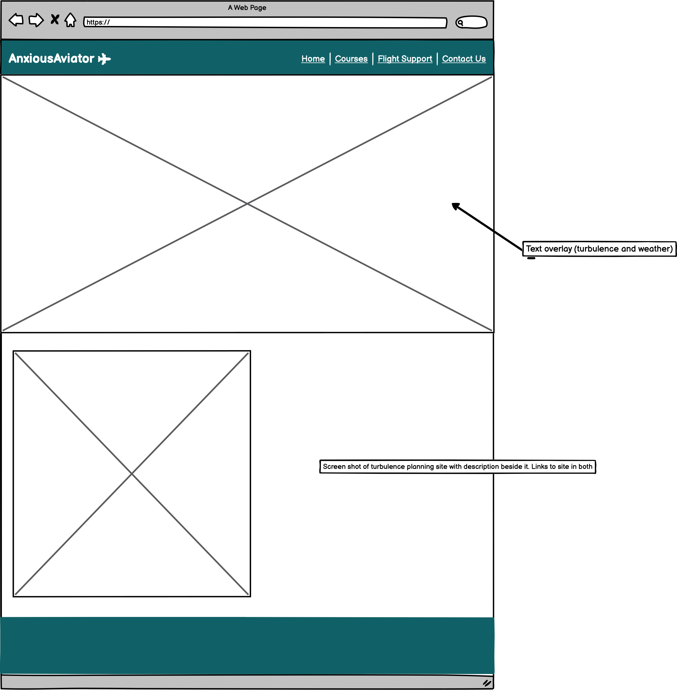
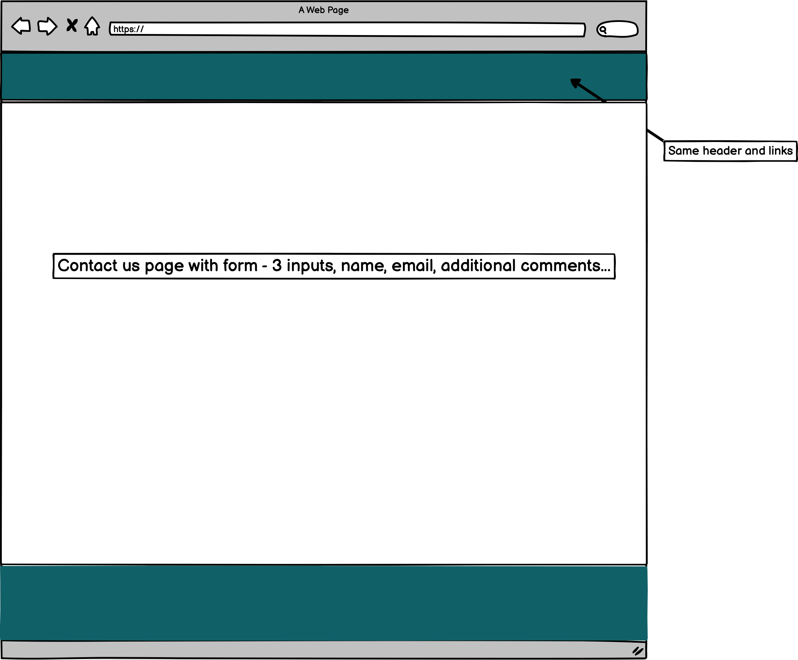

# Anxious Aviator 

Anxious Aviator is a site that hopes to help people overcome their fear of flying. The theme of the site is broken down into two parts; course information and knowledge. The site is targeted at people of all ages who struggle with a fear of flying and wish to overcome it. Anxious Aviator will provide information about courses being run to overcome this fear. It will also provide some information about turbulence and aircraft testing hoping to increase knowledge and understanding of these topics and overcome fear and anxiety. 

<!-- Responsive mockup screenshots here -->

<!-- Features section here -->
## Features

### Navigation
The site is a single page site with four different sections, easily accessible via sidebar/navbar and utilising a smooth scroll function throughout.

#### Sidebar
Below 750px there is a collapsed sidebar with an intuitive open button in the center of the screen below the logo. Upon pressing the open button, a sidebar emerges from the left hand side of the screen and four navigation options are displayed, along with an option to close the sidebar in the top right corner. The background image is predominantly light pink, of a plane with white contrails. The black text on light pink background provides a good contrast ratio . The four navigation options are 'Home', 'Courses', 'Flight Support' and Sign-Up'. Pressing any of this options will navigate the site to the selected section utilising a smooth scroll function utilised across the whole site.

<!-- Screenshot of sidebar -->

#### Navbar
Above 750px, a conventional inline navbar is displayed directly beneath the logo. The four naviagtion options are displayed in white text on a dark navy background providing a good contrast ratio to the user. Above 1200px the navbar moves to the top right of the screen in-line with the logo which has moved to the top left of the screen.

<!-- Screenshot of navbar -->

### Landing Page
The landing page consists of an image with a text overlay. The image is a dynamic shot of a plane overhead in the sky with contrails trailing behind. The dark blue sky is consistent with the overall color scheme of the site. The text overly is eye catching and the text indicates the purpose of the site. Below the text overlay there is a 'Sign Up Now' link which will navigate the user directly to the sign-up form at the bottom of the site.

<!-- Screenshot of landing page -->

### Info section 

The Info Section provides the user with a brief overview of what's on offer from Anxious Aviator. It consists of two images and two areas of text, both featuring headline questions to draw the user in. Each section also features a 'call-to-action' in the form of a 'Sign-Up' button, which links to the sign-up form, and a 'Learn More' button, which links to the Flight Support section. The first area mentions the amount of course options along with
with a link to the course options section. The second area of text refers to the Flight Support section of the site and its function. It also features a link to the FLight Support section. The section is fully repsonsive and the two images are different dependent on the screen size being above or below 750px.

<!-- Screenshot of info section and different images above and below 750px -->

### Customer reviews

There are two customer reviews displayed on the site. The reviews will give the user confidence in the quality of the products on offer from Anxious Aviator. The display of the reviews is consistent with the color scheme of the site and features a strong contrast ratio for accessibility. The two reviews frame the Course Info section on either side, emphasising the quality of the courses offered in between, to the user.

<!-- Screenshot of Customer Review section -->

### Course info section

The Course Info section provides the user with information about the three different course options on offer in a clear and concise way. The section is fully responsive and is displayed as a column below 750px and as a row above 750px. The background image features an airplane simulator cockpit indicating to the user the method of delivery of the courses. The background image has a black transparent overlay with white text on top displaying the course information. The section highlights each course option with an eye catching zoom animation on mouse hover.

<!-- Screenshot of Course Info section -->

### Flight Support

The Flight Support section is the 'knowledge' section of the site. This section will provide the user with information about turbulence, aircraft strength testing and also turbulence forecasting. It consists of a headline question with an icon to improve the user experience. The body of text below gives a description of turbulence. The embedded Youtube video has intuitive controls. This enhances the user experience as they have the option to play the video, control the volume, open the video on Youtube itself in a separate tab and also to view the video in full-screen. The text beneath the video refers to turbulence forecasting and provides a link to an external site (opens in a new tab) so the user can check to see if they will encounter turbulence on their upcoming flight. There is also a 'call-to-action' in the form of a button 'Check My Flight' which also links to the same external site (https://turbli.com/) in a new tab.

<!-- Screenshot of Flight Support section and turbli.com -->

### Sign-Up form

The Sign-Up form at the bottom of the site provides the user with an opportunity to sign up for one of the courses and to recieve more information from Anxious Aviator. It features a headline statment with an icon, empowering the user to sign up for one of the courses. The sign up form is clear and concise and features a background image with a black transparent overlay. The image of a paper plane is light and up-beat and provides the user with a sense of positivity around flying. Upon submission of the form the user is presented with a confirmation page, confirming submission of the form and then automatically redirecting the user back to the home landing page.

<!-- Screenshot of Sign-Up form and confirmation page -->

### Social links

At the foot of the page the social links are displayed. They provide the user with links directly to the four social media platforms used by Anxious Aviator; Facebook, Instagram, Twitter and Youtube. They are displayed to the user using their logo's which are clickable links. The social media pages open in a separate tab, preventing the user having to use the back function to return to the Anxious Aviator site, improving the user experience. They are displayed in white on a dark blue background, in the same way as the header.

<!-- Screenshot of Social links -->

<!-- Testing -->

## Testing

Validator testing

Manual Testing

Unfixed bugs

<!-- Deployment -->
## Deployment

<!-- Credits -->
## Credits

Content

Media

Code

I've used Balsamiq to design my wireframes.

- Home Page
    

- Courses page
    

- Flight Support page
    

- Contact Us
    
