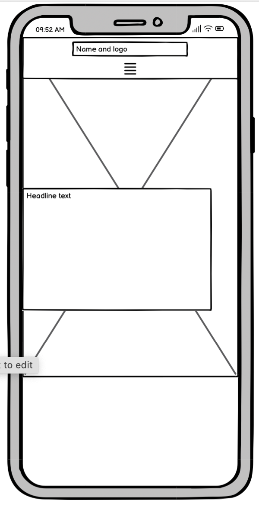
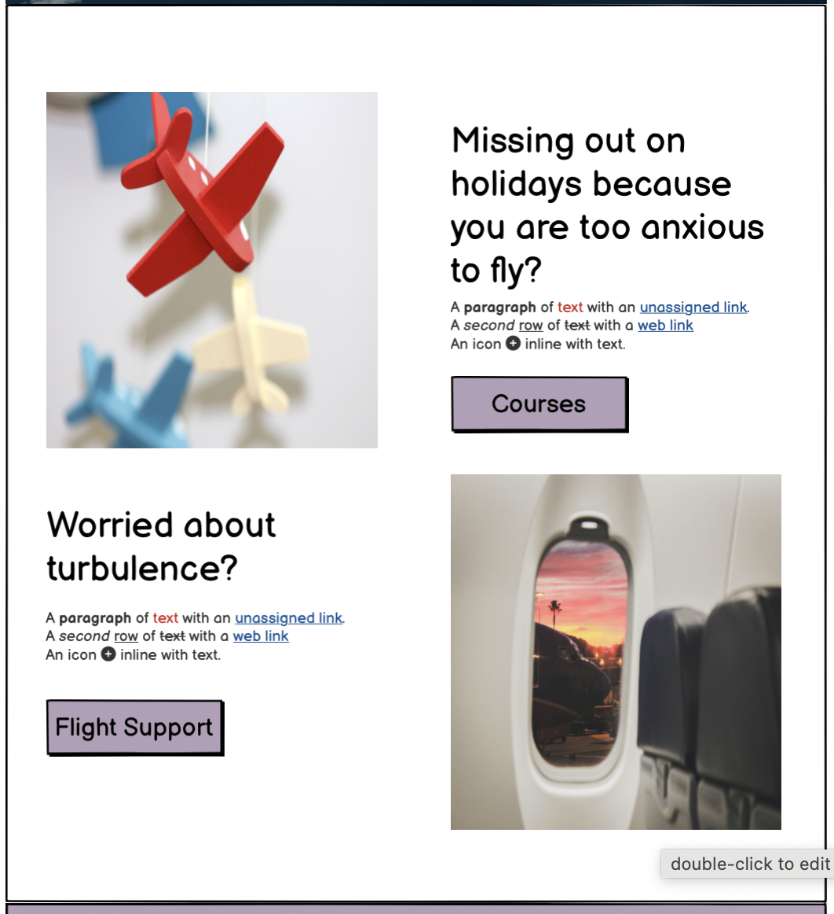

# ANXIOUS AVIATOR

Anxious Aviator is a site that hopes to help people overcome their fear of flying. The theme of the site is broken down into two parts; information about the courses provided by Anxious Aviator and information about common causes of anxiety surrounding flying. The site is targeted at people of all ages who struggle with a fear of flying and who wish to overcome it. Users will find the site useful as the site in intuitive, clearly laid out and can access the information and sign up to a course with minimal clicks. 

## UX

As the concept of the company is simple and straight forward, I wanted the design of the site to reflect this. I wanted to have a single page website with a navbar at the top with links to the various sections. I liked the idea of a large hero-image as the landing page with a short statement or question empahsised in the middle to instantly highlight the intention of the website. I searched for samples of website layouts to find inspiration. This one, Almar from squarespace was clean, concise and to the point so I used that as my inspiration. https://www.squarespace.com/templates/almar-fluid-demo 

### Colour Scheme

I elected to go with a shade dark blue as the core color for the site as it is associated with characteristics of trust, responsibility and calmness. I chose white, cream, and shades of brown as complimentary colors.

- `#FFFFFF` used for primary text.
- `#FD9C35` used for primary highlights.
- `#000000` used for secondary text.
- `#FD9C35` used for secondary highlights.

I used [coolors.co](https://coolors.co/103a55-ffffff-934106-f6ebe0-255c7e-fd9c35) to generate my colour palette.

### Typography

- [Lato](https://fonts.google.com/specimen/Lato) was used for the primary headers and titles.

- [Montserrat](https://fonts.google.com/specimen/Montserrat) was used for all other secondary text.

- [Font Awesome](https://fontawesome.com) icons were used throughout the site, such as the social media icons in the footer.

## User Stories

### New Site Users

- As a new site user, I would like to understand the purpose of the site, so that I can decide if it matches my needs.
- As a new site user, I would like to clearly see what's on offer, so that I can make a decision.
- As a new site user, I would like to be able to navigate the site easily, so that I don't waste my time.
- As a new site user, I would like to sign-up with minimal clicks, so that I don't waste my time.
- As a new site user, I would like to access social media links, so that I can assess the product.

## Wireframes

To follow best practice, wireframes were developed for mobile, tablet, and desktop sizes.
I've used [Balsamiq](https://balsamiq.com/wireframes) to design my site wireframes.

### Home Page Wireframes

| Size | Screenshot |
| --- | --- |
| Mobile |  |
| Tablet |  |
| Desktop |  |

### Info Section Wireframes

| Size | Screenshot |
| --- | --- |
| Mobile |  |
| Desktop |  |

### Course Info Section Wireframes

| Size | Screenshot |
| --- | --- |
| Mobile |  |
| Tablet |  |
| Desktop |  |

### Flight Support Section Wireframes

| Size | Screenshot |
| --- | --- |
| Mobile |  |
| Desktop |  |

### Sign-Up Form  Section Wireframes

| Size | Screenshot |
| --- | --- |
| Mobile |  |

## Features

### Existing Features

- **Navigation**

    *The site is a single page site with four different sections, easily accessible via sidebar/navbar and utilising a smooth scroll function throughout.*

    #### - Sidebar

    - Below 750px there is a collapsed sidebar with an intuitive open button in the center of the screen below the logo. Upon pressing the open button, a sidebar emerges from the left hand side of the screen and four navigation options are displayed, along with an option to close the sidebar in the top right corner. The background image is predominantly light pink, of a plane with white contrails. The black text on light pink background provides a good contrast ratio . The four navigation options are 'Home', 'Courses', 'Flight Support' and Sign-Up'. Pressing any of this options will navigate the site to the selected section utilising a smooth scroll function utilised across the whole site. This provides the user with a clear map of the site and efficient navigation.

        

   #### - Navbar

    - Above 750px, a conventional inline navbar is displayed directly beneath the logo. The four naviagtion options are displayed in white text on a dark navy background providing a good contrast ratio to the user. Above 1200px the navbar moves to the top right of the screen in-line with the logo which has moved to the top left of the screen.

        

- **Home Page**

    - The home page consists of an image with a text overlay. The image is a dynamic shot of a plane overhead in the sky with contrails trailing behind. The dark blue sky is consistent with the overall color scheme of the site. The text overly is eye catching and the text indicates the purpose of the site to the user. Below the text overlay there is a 'Sign Up Now' link which will navigate the user directly to the sign-up form at the bottom of the site.

        

- **Info Section**

    - The Info Section provides the user with a brief overview of what's on offer from Anxious Aviator. It consists of two images and two areas of text, both featuring headline questions to draw the user in. Each section also features a 'call-to-action' in the form of a 'Sign-Up' button, which links to the sign-up form, and a 'Learn More' button, which links to the Flight Support section. The first area mentions the amount of course options along with a link to the course options section. The second area of text refers to the Flight Support section of the site and its function. It also features a link to the FLight Support section. The section is fully repsonsive and the two images are different dependent on the screen size being above or below 750px.

        

- **Customer Reviews**

    - There are two customer reviews displayed on the site. The reviews will give the user confidence in the quality of the products on offer from Anxious Aviator. The display of the reviews is consistent with the color scheme of the site and features a strong contrast ratio for accessibility. The two reviews frame the Course Info section on either side, emphasising the quality of the courses offered in between, to the user.

        

- **Course Info Section**

    - The Course Info section provides the user with information about the three different course options on offer in a clear and concise way. The section is fully responsive and is displayed as a column below 750px and as a row above 750px. The background image features an airplane simulator cockpit indicating to the user the method of delivery of the courses. The background image has a black transparent overlay with white text on top displaying the course information. The section highlights each course option with an eye catching zoom animation on mouse hover.

        

- **Flight Support**

    - The Flight Support section is the 'knowledge' section of the site. This section will provide the user with information about turbulence, aircraft strength testing and also turbulence forecasting. It consists of a headline question with an icon to improve the user experience. The body of text below gives a description of turbulence. The embedded Youtube video has intuitive controls. This enhances the user experience as they have the option to play the video, control the volume, open the video on Youtube itself in a separate tab and also to view the video in full-screen. The text beneath the video refers to turbulence forecasting and provides a link to an external site (opens in a new tab) so the user can check to see if they will encounter turbulence on their upcoming flight. There is also a 'call-to-action' in the form of a button 'Check My Flight' which also links to the same external site (https://turbli.com/) in a new tab.

        

- **Sign-Up Form**

    - The Sign-Up form at the bottom of the site provides the user with an opportunity to sign up for one of the courses and to recieve more information from Anxious Aviator. It features a headline statment with an icon, empowering the user to sign up for one of the courses. The sign up form is clear and concise and features a background image with a black transparent overlay. The image of a paper plane is light and up-beat and provides the user with a sense of positivity around flying. Upon submission of the form the user is presented with a confirmation page, confirming submission of the form and then automatically redirecting the user back to the home landing page.

        

- **Social Links**

    - At the foot of the page the social links are displayed. They provide the user with links directly to the four social media platforms used by Anxious Aviator; Facebook, Instagram, Twitter and Youtube. They are displayed to the user using their logo's which are clickable links. The social media pages open in a separate tab, preventing the user having to use the back function to return to the Anxious Aviator site, improving the user experience. They are displayed in white on a dark blue background, in the same way as the header.

        

### Future Features

- Stripe Payment Function
    - In the future I would like to add a function to accept payments through Stripe so users can purchase courses directly through the site.
- Flip cards for Course Info Section
    - I would like to add flipcards to the Course Info section with pricing information on the other side of the flip card.
    https://www.w3schools.com/howto/howto_css_flip_card.asp
- Embedded Flight Radar
    - I would like to add an embedded map of FLightradar 24 to the Flight Support Section.

## Tools & Technologies Used

- [HTML](https://en.wikipedia.org/wiki/HTML) used for the main site content.
- [CSS](https://en.wikipedia.org/wiki/CSS) used for the main site design and layout.
- [CSS Flexbox](https://www.w3schools.com/css/css3_flexbox.asp) used for an enhanced responsive layout.
- [JavaScript](https://www.javascript.com) used for implementation of side-bar navigation.
- [Git](https://git-scm.com) used for version control. (`git add`, `git commit`, `git push`)
- [GitHub](https://github.com) used for secure online code storage.
- [GitHub Pages](https://pages.github.com) used for hosting the deployed front-end site.
- [Gitpod](https://gitpod.io) used as a cloud-based IDE for development.
-
## Testing

For all testing, please refer to the [TESTING.md](TESTING.md) file.

## Deployment

The site was deployed to GitHub Pages. The steps to deploy are as follows:
- In the [GitHub repository](https://github.com/JamesH003/Anxious-Aviator), navigate to the Settings tab 
- From the source section drop-down menu, select the **Main** Branch, then click "Save".
- The page will be automatically refreshed with a detailed ribbon display to indicate the successful deployment.

The live link can be found [here](https://jamesh003.github.io/Anxious-Aviator)

### Local Deployment

This project can be cloned or forked in order to make a local copy on your own system.

#### Cloning

You can clone the repository by following these steps:

1. Go to the [GitHub repository](https://github.com/JamesH003/Anxious-Aviator) 
2. Locate the Code button above the list of files and click it 
3. Select if you prefer to clone using HTTPS, SSH, or GitHub CLI and click the copy button to copy the URL to your clipboard
4. Open Git Bash or Terminal
5. Change the current working directory to the one where you want the cloned directory
6. In your IDE Terminal, type the following command to clone my repository:
	- `git clone https://github.com/JamesH003/Anxious-Aviator.git`
7. Press Enter to create your local clone.

Alternatively, if using Gitpod, you can click below to create your own workspace using this repository.

Please note that in order to directly open the project in Gitpod, you need to have the browser extension installed.
A tutorial on how to do that can be found [here](https://www.gitpod.io/docs/configure/user-settings/browser-extension).

#### Forking

By forking the GitHub Repository, we make a copy of the original repository on our GitHub account to view and/or make changes without affecting the original owner's repository.
You can fork this repository by using the following steps:

1. Log in to GitHub and locate the [GitHub Repository](https://github.com/JamesH003/Anxious-Aviator)
2. At the top of the Repository (not top of page) just above the "Settings" Button on the menu, locate the "Fork" Button.
3. Once clicked, you should now have a copy of the original repository in your own GitHub account!

<!-- ### Local VS Deployment

⚠️⚠️⚠️⚠️⚠️ START OF NOTES (to be deleted) ⚠️⚠️⚠️⚠️⚠️

Use this space to discuss any differences between the local version you've developed, and the live deployment site on GitHub Pages.

🛑🛑🛑🛑🛑 END OF NOTES (to be deleted) 🛑🛑🛑🛑🛑 -->

## Credits

### Content

| Source | Location | Notes |
| --- | --- | --- |
| [Markdown Builder](https://traveltimn.github.io/markdown-builder) | README and TESTING | tool to help generate the Markdown files |
| [W3Schools](https://www.w3schools.com/howto/howto_js_collapse_sidebar.asp) | header up to 750px | collapsed sidebar |
| [W3Schools](https://www.w3schools.com/howto/howto_css_smooth_scroll.asp#section2) | entire site | smooth scroll |
| [W3Schools](https://www.w3schools.com/tags/tag_iframe.ASP) | flight support section | iframe |
| [Love Running](https://learn.codeinstitute.net/courses/course-v1:CodeInstitute+LR101+2021_T1/courseware/4a07c57382724cfda5834497317f24d5/6fd29d155c3b42248ff57bae32978a4b/?child=first) | home page | cover text html |
| [Flexbox Froggy](https://flexboxfroggy.com/) | entire site | modern responsive layouts |
[CSS Tricks](https://css-tricks.com/focusing-background-image-precise-location-percentages/) | home-page | background-image position |
[FlyFearless](https://www.flyfearless.ie/#pick-your-course) | entire site | content |
[Fly Confidently](https://flyconfidently.com/scared-of-turbulence/) | flight support section | content |
[Squarespace](https://www.squarespace.com/templates/almar-fluid-demo) | entire site | design layout |

### Media

<!-- ⚠️⚠️⚠️⚠️⚠️ START OF NOTES (to be deleted) ⚠️⚠️⚠️⚠️⚠️

Use this space to provide attribution links to any images, videos, or audio files borrowed from online.
A few examples have been provided below to give you some ideas.

If you're the owner (or a close acquaintance) of all media files, then make sure to specify this.
Let the assessors know that you have explicit rights to use the media files within your project.

Ideally, you should provide an actual link to every media file used, not just a generic link to the main site!
The list below is by no means exhaustive. Within the Code Institute Slack community, you can find more "free media" links
by sending yourself the following command: `!freemedia`.

🛑🛑🛑🛑🛑 END OF NOTES (to be deleted) 🛑🛑🛑🛑🛑 -->

| Source | Location | Type | Notes |
| --- | --- | --- | --- |
| [Pexels](https://www.pexels.com/photo/photo-of-cockpit-3942318/) | course info section | image | cockpit |
| [Pexels](https://www.pexels.com/photo/silhouette-photo-of-man-throw-paper-plane-1262304/) | sign-up form, confirmation page | image | paper plane |
| [Pexels](https://www.pexels.com/photo/photo-of-airplane-with-smoke-trail-2088203/) | side bar | image | plane contrails on pink sky |
| [Pexels](https://www.pexels.com/photo/white-airplane-with-smoke-under-blue-sky-728824/) | home page | image | plane contrails |
| [Pexels](https://www.pexels.com/photo/airplane-window-seat-view-of-white-clouds-4004058/) | info section | image | plane window |
| [Pexels](https://www.pexels.com/photo/heavy-clouds-1828305/) | info section | image | storm clouds |
| [Pexels](https://www.pexels.com/photo/grey-white-clouds-158163/) | info section | image | storm clouds |
| [Pexels](https://www.pexels.com/photo/miniature-of-a-plane-255514/) | info section | image | toy plane |
| [PNG EGG](https://www.pngegg.com/en/png-zgkkr) | entire site | favicon | entire site |
| [Youtube](https://www.youtube.com/embed/--LTYRTKV_A) | flight support | video | iframe |

### Acknowledgements

<!-- ⚠️⚠️⚠️⚠️⚠️ START OF NOTES (to be deleted) ⚠️⚠️⚠️⚠️⚠️

Use this space to provide attribution to any supports that helped, encouraged, or supported you throughout the development stages of this project.
A few examples have been provided below to give you some ideas.

🛑🛑🛑🛑🛑 END OF NOTES (to be deleted) 🛑🛑🛑🛑🛑 -->

- I would like to thank my Code Institute mentor, [Tim Nelson](https://github.com/TravelTimN) for their support throughout the development of this project.
- I would like to thank the [Code Institute](https://codeinstitute.net) tutor team for their assistance with troubleshooting and debugging some project issues.
- I would like to thank the [Code Institute Slack community](https://code-institute-room.slack.com) for the moral support; it kept me going during periods of self doubt and imposter syndrome.
- I would like to thank my girlfriend, Caoimhe, for supporting me during the making of this project.
