# Testing

Return back to the [README.md](README.md) file.

## Code Validation

### HTML

I have used the recommended [HTML W3C Validator](https://validator.w3.org) to validate all of my HTML files.

| Page | W3C URL | Screenshot | Notes |
| --- | --- | --- | --- |
| Entire site | [W3C](https://validator.w3.org/nu/?doc=https%3A%2F%2Fjamesh003.github.io%2FAnxious-Aviator%2F) | 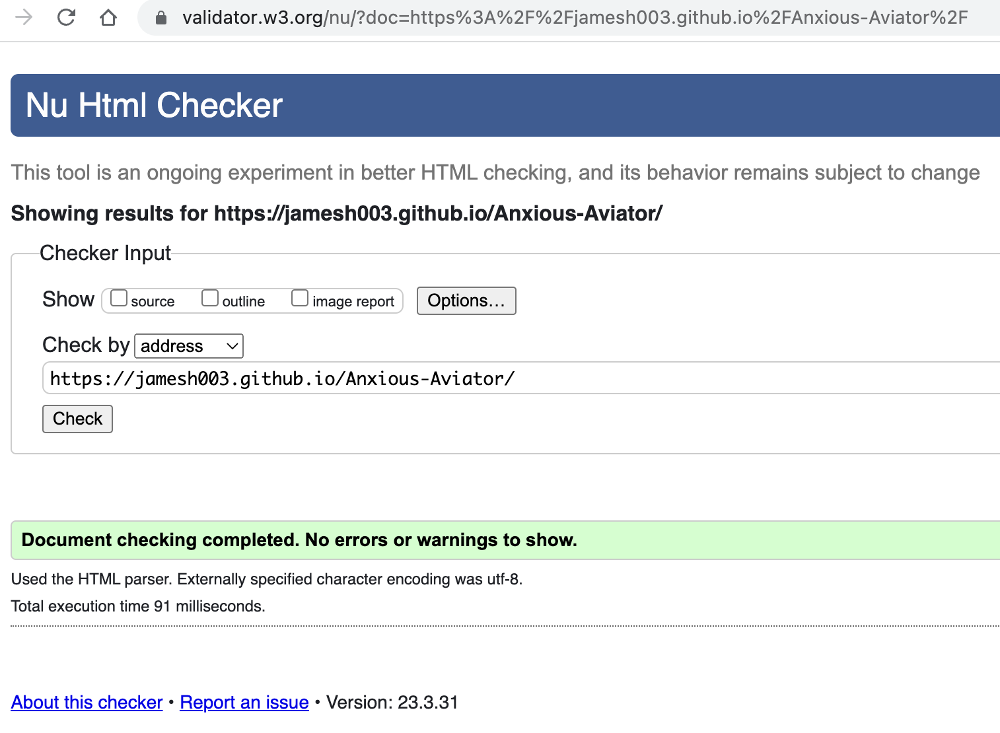 | Pass: No Errors|

### CSS

I have used the recommended [CSS Jigsaw Validator](https://jigsaw.w3.org/css-validator) to validate all of my CSS files.

| File | Jigsaw URL | Screenshot | Notes |
| --- | --- | --- | --- |
| style.css | [Jigsaw](https://jigsaw.w3.org/css-validator/validator?uri=https%3A%2F%2Fjamesh003.github.io%2FAnxious-Aviator%2F&profile=css3svg&usermedium=all&warning=1&vextwarning=&lang=en) | 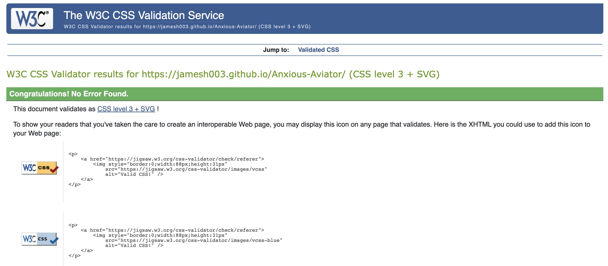 | Pass: No Errors |

## Browser Compatibility

I've tested my deployed project on multiple browsers to check for compatibility issues.

| Browser | Screenshot | Notes |
| --- | --- | --- |
| Chrome |  | Works as expected |
| Firefox | 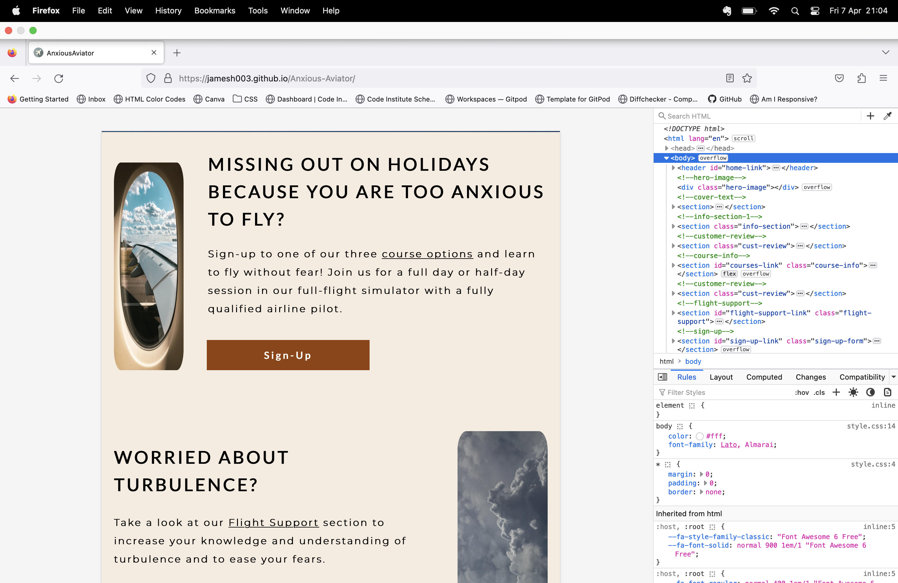 | problem with info section images width responsiveness above 750px |
| Edge | 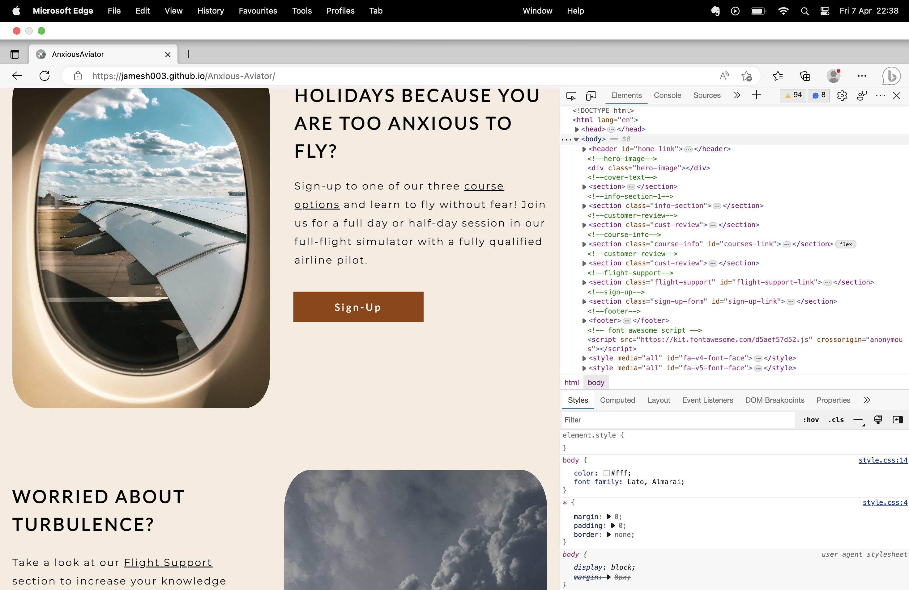 | Works as expected |
| Safari | 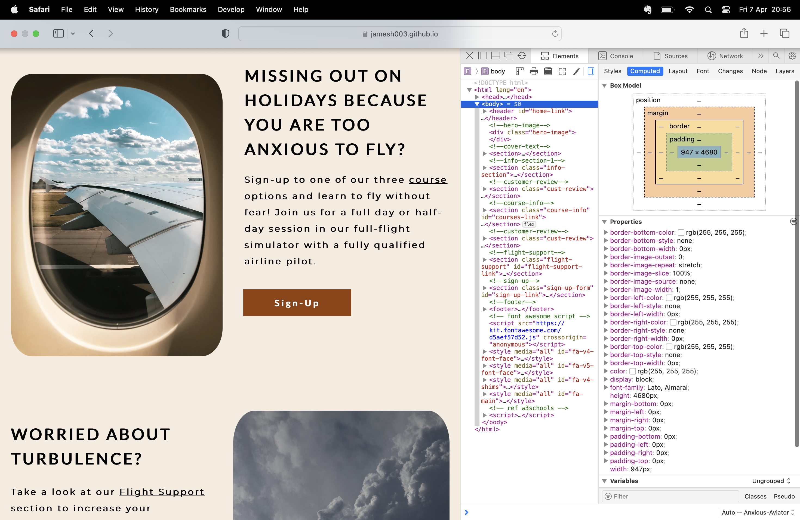 | Works as expected |
| Brave | 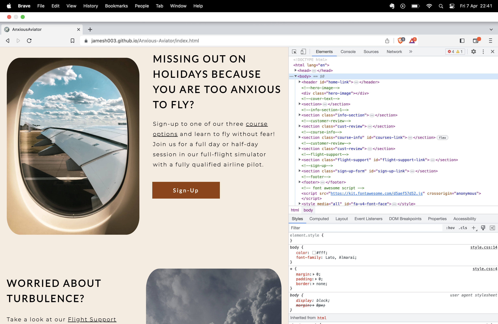 | Works as expected |
| Opera | 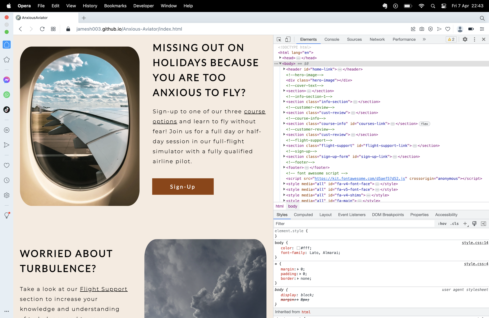 | Works as expected |

## Responsiveness

I've tested my deployed project on multiple devices to check for responsiveness issues.

| Device | Screenshot | Notes |
| --- | --- | --- |
| Mobile (DevTools) | 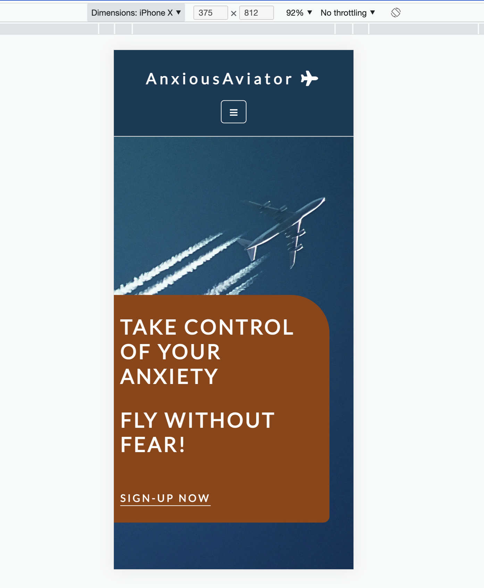 | Works as expected |
| Tablet (DevTools) |  | Works as expected |
| Desktop |  | Works as expected |
| iPhone 11 |  | Works as expected |

## Lighthouse Audit

I've tested my deployed project using the Lighthouse Audit tool to check for any major issues.

| Size | Screenshot | Notes |
| --- | --- | --- |
| Desktop | 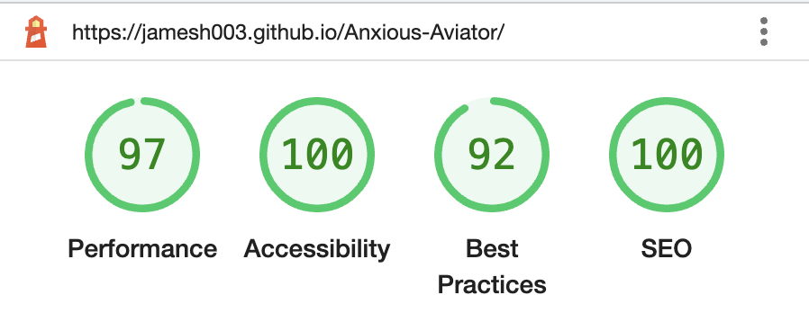 | No warnings |
| Mobile | 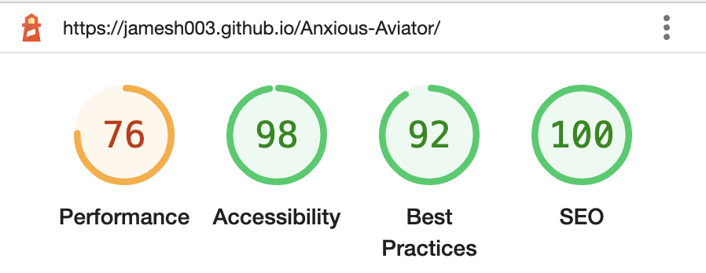 | Some minor warnings |

## User Story Testing

| User Story | Screenshot |
| --- | --- |
| As a new site user, I would like to understand the purpose of the site, so that I can decide if it matches my needs. |  |
| As a new site user, I would like to clearly see what's on offer, so that I can make a decision. |  |
| As a new site user, I would like to be able to navigate the site easily, so that I don't waste my time. |  |
| As a new site user, I would like to sign-up with minimal clicks, so that I don't waste my time. |  |
| As a new site user, I would like to access social media links, so that I can assess the product.|  |

## Bugs

- CSS - Contrast ratio of normal text on cover-text background fail.

    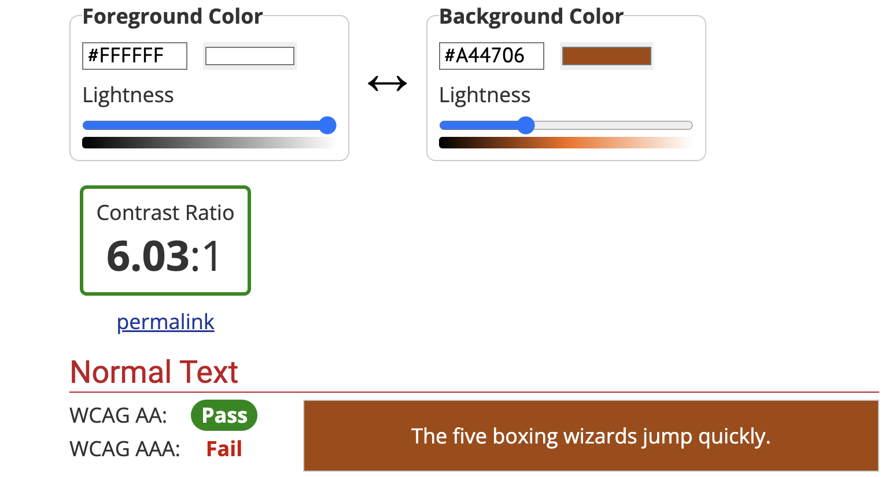
    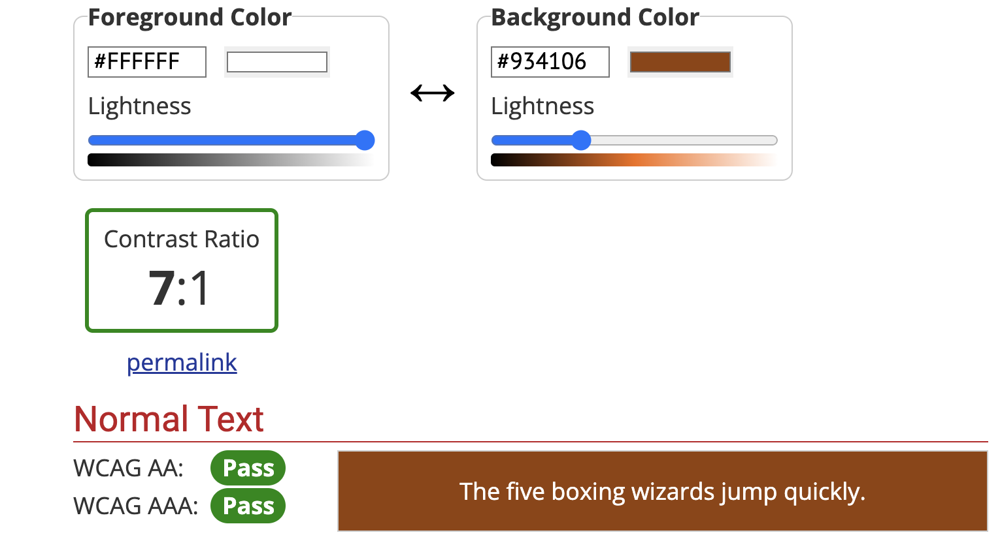

    - To fix this, I changed the background-color of the cover-text section to #934106.

- CSS - Home page background image positioning on full screen

    

    - To fix this, I used background-position-y: -75px;.

- CSS - Overflow-x scrolling on mobile screens - width property found in youtube link

    

    - To fix this, I removed the width property from link.

- CSS - Overflow-x scrollin on all devices due zoom animation on hover using keyframes attributed to div container in course-info section.

    - To fix this, I removed the keyframes and added an additional div with class="hover-zoom" to wrap the text. Targeted "hover-zoom" div with an ease-in-out transition.

## Unfixed Bugs

There are no remaining bugs that I am aware of.
