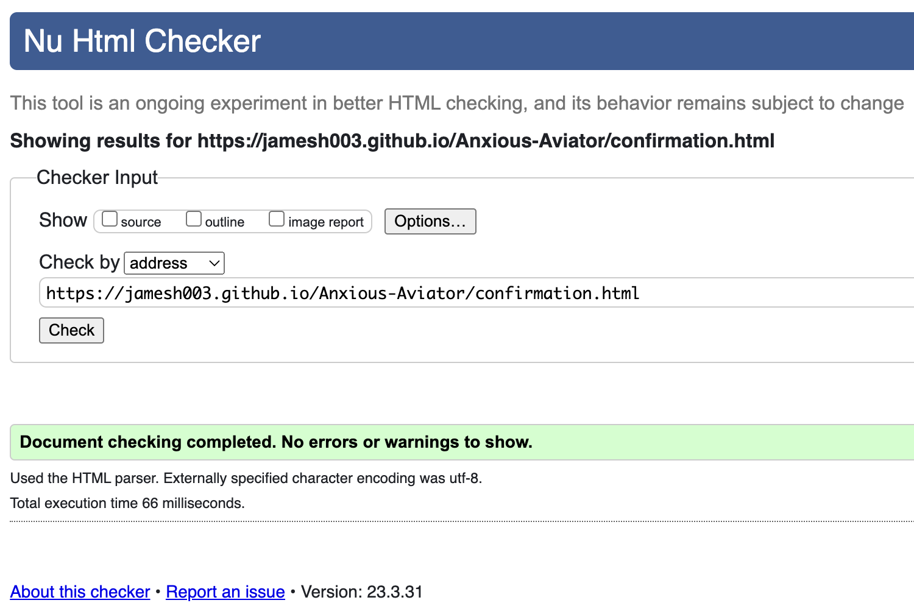
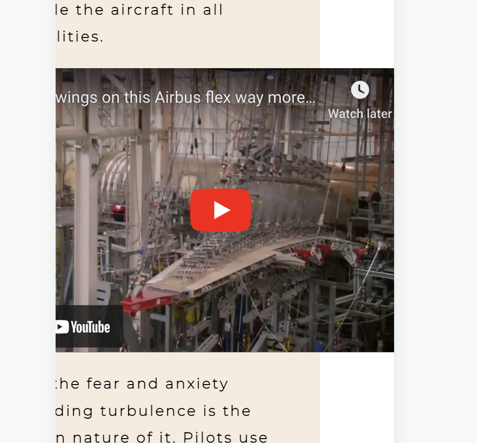
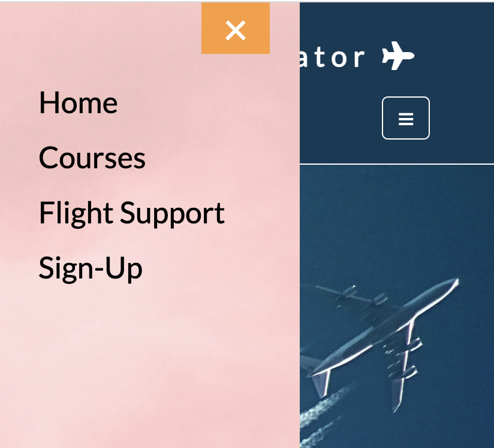
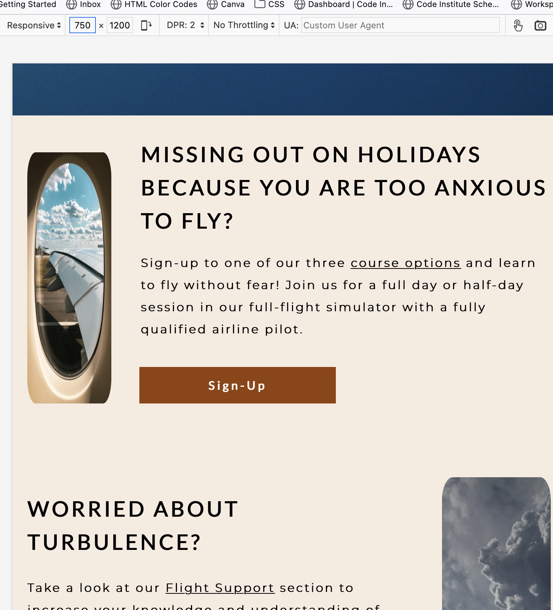

# Testing

Return back to the [README.md](README.md) file.

## Code Validation

### HTML

I have used the recommended [HTML W3C Validator](https://validator.w3.org) to validate all of my HTML files.

| Page | W3C URL | Screenshot | Notes |
| --- | --- | --- | --- |
| index.html | [W3C](https://validator.w3.org/nu/?doc=https%3A%2F%2Fjamesh003.github.io%2FAnxious-Aviator%2F) |  | Pass: No Errors|
| confirmation.html | [W3C](https://validator.w3.org/nu/?doc=https%3A%2F%2Fjamesh003.github.io%2FAnxious-Aviator%2Fconfirmation.html) |  | Pass: No Errors|

### CSS

I have used the recommended [CSS Jigsaw Validator](https://jigsaw.w3.org/css-validator) to validate all of my CSS files.

| File | Jigsaw URL | Screenshot | Notes |
| --- | --- | --- | --- |
| style.css | [Jigsaw](https://jigsaw.w3.org/css-validator/validator?uri=https%3A%2F%2Fjamesh003.github.io%2FAnxious-Aviator%2F&profile=css3svg&usermedium=all&warning=1&vextwarning=&lang=en) |  | Pass: No Errors |

## Browser Compatibility

I've tested my deployed project on multiple browsers to check for compatibility issues.

| Browser | Screenshot | Notes |
| --- | --- | --- |
| Chrome |  | Works as expected |
| Firefox |  | Problem with info section images width responsiveness above 750px. All else works as expected |
| Edge |  | Works as expected |
| Safari |  | Works as expected |
| Brave |  | Works as expected |
| Opera |  | Works as expected |

## Responsiveness

I've tested my deployed project on multiple devices to check for responsiveness issues.

| Device | Screenshot | Notes |
| --- | --- | --- |
| Mobile (DevTools) |  | Works as expected |
| Tablet (DevTools) |  | Works as expected |
| Desktop |  | Works as expected |
| iPhone 11 |  | Works as expected |

## Lighthouse Audit

I've tested my deployed project using the Lighthouse Audit tool to check for any major issues.

| Size | Screenshot | Notes |
| --- | --- | --- |
| Desktop |  | No warnings |
| Mobile |  | Some minor warnings |

## User Story Testing

| User Story | Screenshot |
| --- | --- |
| As a new site user, I would like to understand the purpose of the site, so that I can decide if it matches my needs. |  |
| As a new site user, I would like to clearly see what's on offer, so that I can make a decision. |  |
| As a new site user, I would like to be able to navigate the site easily, so that I don't waste my time. |  |
| As a new site user, I would like to sign-up with minimal clicks, so that I don't waste my time. |  |
| As a new site user, I would like to access social media links, so that I can assess the product.|  |

## Bugs

- CSS - Contrast ratio of normal text on cover-text background fail.

    
    

    - To fix this, I changed the background-color of the cover-text section to `#934106`.

- CSS - Home page background image positioning on full screen

    

    - To fix this, I used `background-position-y: -75px;`.

- CSS - Overflow-x scrolling on mobile screens - width property found in youtube link

    

    - To fix this, I removed the width property from link.

- CSS - Overflow-x scrollin on all devices due zoom animation on hover using keyframes attributed to div container in course-info section.

    - To fix this, I removed the keyframes and added an additional div with class="hover-zoom" to wrap the text. Targeted "hover-zoom" div with an ease-in-out transition.

- HTML - Upon selection of the close button on the sidebar, the page would always scroll back to the top of the home page.

    

    - To fix this, I changed the HTML code from this: 
        ``` HTML
            <div id="mySidebar" class="sidebar">
                <a href="#" class="closebtn" onclick="closeNav()">&times;</a>
                <a href="#home-link">Home</a>
                <a href="#courses-link">Courses</a>
                <a href="#flight-support-link">Flight Support</a>
                <a href="#sign-up-link">Sign-Up</a>
            </div>
         ```

         To this:

         ``` HTML
            <div id="mySidebar" class="sidebar">
                <span class="closebtn" onclick="closeNav()">&times;</span>
                <a href="#home-link">Home</a>
                <a href="#courses-link">Courses</a>
                <a href="#flight-support-link">Flight Support</a>
                <a href="#sign-up-link">Sign-Up</a>
            </div>
        ```


## Unfixed Bugs

- On Firefox the image of the plane window becomes distorted on screen sizes above 750px.

    

    - Attempted fix: I tried to amend the width property in the media query for 750px and above but it caused the image to distort on other browsers. I also tried to add a Mozilla prefix but it didn't work. 
    
    ``` CSS
    .plane-window {
        display: -webkit-box;
        display: -ms-flexbox;
        display: flex;
        width: 46%;
        margin: 50px 20px 40px 20px;
        border-radius: 10%;
    }
    ```

    I also tried to add `min-width: 46%;` to the image class but it caused the image to break at larger sizes.

     ``` CSS
    .plane-window {
        display: -webkit-box;
        display: -ms-flexbox;
        display: flex;
        width: 46%;
        min-width: 46%;
        margin: 50px 20px 40px 20px;
        border-radius: 10%;
    }
    ```
